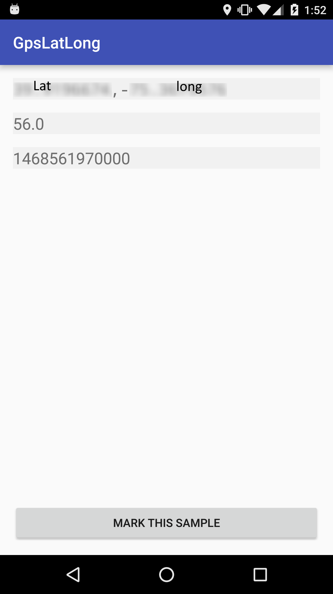

# Android GPS Logging Util

**HAS ONLY BEEN TESTED ON NEXUS 6**

## Building

* use [android studio](https://developer.android.com/studio/index.html)
* connect device, run app from android studio
* use it?

## Usage

* First line is latitude then longitude (comma separated)
* Second line is altitude (this isn't quite as reliable)
* Third line has the unix timestamp from last gps sample

default sample rate is 1hz (will be user changeable soon)

In your downloads folder there will be a file called gpslog. It will contain comma separated values in the order

    UNIX_TIMESTAMP,LATITUDE,LONGITUDE,MARK_STATUS

When the 'mark sample' button is pressed, `MARK_STATUS` will be `MARK` instead of `NOMARK`.

To import into libreoffice calc or excel treat is as comma seperated values and make sure to sort by unix timestamp col.

## Screenshot

Blurred part is because I don't want to give people my location accurate to ~100m :-).

